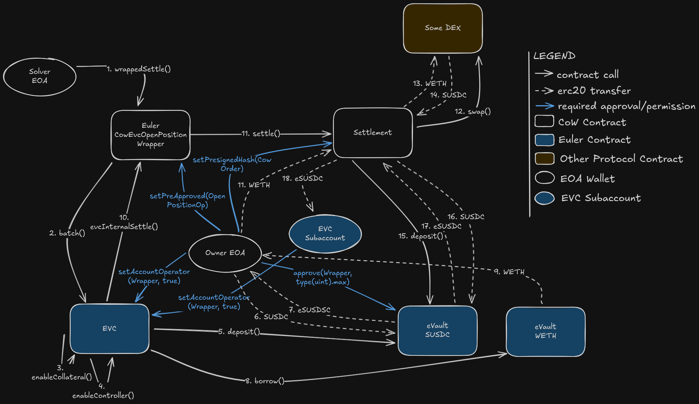

# Opening Leveraged Positions with CowEvcOpenPositionWrapper

## Overview

The [`CowEvcOpenPositionWrapper`](../../src/CowEvcOpenPositionWrapper.sol) enables users to atomically open or grow leveraged trading positions by:

1. Depositing collateral into a vault
2. Borrowing assets against that collateral
3. Swapping borrowed assets back into collateral via CoW Protocol
4. All within a single atomic EVC batch

This pattern allows leveraged long/short positions with optimal execution through CoW's distributed solver network.



## Use Cases

Assuming 1 ETH = 1000 USDC

### Leveraged Long Position
User wants to go 5x long on ETH:
- Deposit 1 ETH as collateral
- Borrow 4000 USDC
- Swap borrowed USDC to ETH collateral
- Result: 5 ETH collateral backing 4000 USDC debt

### Leveraged Short Position
User wants to go 5x short on ETH:
- Deposit 1000 USDC as collateral
- Borrow 5 ETH
- Swap borrowed ETH to USDC collateral
- Result: 6000 USDC collateral backing 5 ETH debt

### Growing Existing Position
User can execute another open position operation to increase leverage on an existing position.

## Transaction Flow

### Step-by-Step Execution

1. **Solver validates authorization**: Checks if caller is authenticated solver
2. **Wrapper validates user authorization**: Verifies permit signature or pre-approved hash
3. **[EVC batch](https://evc.wtf/docs/concepts/internals/batch) assembly**: Wrapper constructs EVC batch items:
   - Optional: EVC.permit() if using permit flow
   - Optional: Enable collateral vault (if first time with this vault)
   - Optional: Enable borrow vault (if first time with this vault)
   - Optional: Approve token transfer if collateralAmount > 0
   - Deposit collateral (if collateralAmount > 0)
   - Borrow the required amount
   - **Settlement callback**: Call settlement to execute CoW swap
4. **Settlement execution**: The solver will perform swaps that functionally:
   - Swaps the borrow asset into the collateral asset
   - Converts the collateral asset into vault tokens using `vault.deposit()`
5. **[EVC account health check](https://evc.wtf/docs/concepts/internals/account-status-checks/)**: Verifies user account is properly collateralized
6. **Batch completion**: If all steps succeed, position is opened

### Memory Layout

Collateral and borrowed asset flows:

```
User's Collateral Asset      User's Borrowed Asset
        |                             |
        v                             v
   Collateral Vault            Borrow Vault
        |                             |
        |                    (Wrapper Borrows)
        |                             |
        |                             v
        |                      Settlement Contract
        |                             |
        |               (CoW Swap: Borrowed -> Collateral)
        |                             |
        +<-----------+----------------+
                     |
                     v
              Collateral Vault (now both initial collateral and borrowed asset)
                     |
                     v
              EVC Subaccount (user's account)
```

## Parameters

### OpenPositionParams Structure

```solidity
struct OpenPositionParams {
    address owner;              // User who authorizes and owns the position
    address account;            // EVC subaccount (can equal owner for default account)
    uint256 deadline;           // Operation deadline (block.timestamp must be ≤ this)
    address collateralVault;    // Vault to hold collateral (e.g., eUSDC)
    address borrowVault;        // Vault to borrow from (e.g., eWETH)
    uint256 collateralAmount;   // Amount of collateral to deposit initially
    uint256 borrowAmount;       // Amount to borrow (in underlying asset)
}
```

#### Parameter Details

- **owner**: The user's address that will own and authorize the position. The CoW order must be signed/authorized by this address.
- **account**: Can be the same as `owner` (default account) or a different [subaccount](https://evc.wtf/docs/concepts/internals/sub-accounts). EVC subaccounts must share the same 19 high-order bits as the owner.
- **deadline**: Used for operation validity and hash uniqueness. If executing multiple operations with identical other parameters, increment deadline for uniqueness.
- **collateralVault**: The vault token address to use as collateral backing (e.g., `eUSDC`)
- **borrowVault**: The vault to borrow from (e.g., `eWETH`). Note: You borrow the underlying asset (WETH), not the vault token
- **collateralAmount**: Amount of underlying collateral asset to deposit. Set to 0 if vault already has margin collateral. This is NOT the same as CoW order `buyAmount`.
- **borrowAmount**: Amount of underlying asset to borrow. This MUST match the CoW order `sellAmount`.

## CoW Order Construction

### Order Parameters

```json
{
  "sellToken": "0x...",           // underlying asset of borrowVault (e.g., WETH)
  "buyToken": "0x...",            // collateralVault (e.g., eUSDC)
  "sellAmount": 5000000000000000000,     // == borrowAmount (5 WETH with 18 decimals)
  "buyAmount": 5000000000000000000,      // Amount of collateral expected back, minus slippage and fees
  "receiver": "0x...",            // == account parameter (the subaccount)
  "kind": "sell",                 // Always "sell" to ensure borrowed amount is fully converted
  "validTo": 1234567890           // Ideally same as deadline parameter
}
```

## Authorization Flows

### Option 1: [EVC Permit](https://evc.wtf/docs/concepts/internals/permit/) (Off-Chain Signature)

This flow requires **two separate signatures** and **one on-chain approval**:

1. **Collateral Asset Approval**: Approves the collateral vault to spend the collateral asset (only if `collateralAmount > 0`)
2. **EVC Permit Signature**: Authorizes the wrapper to operate on the owner's behalf
3. **CoW Order Signature**: Authorizes the CoW order itself

```solidity
// Step 1: Approve collateral asset (only if depositing new margin)
// This must be done on-chain before the settlement
if (params.collateralAmount > 0) {
    IERC20 collateralAsset = IERC20(IEVault(params.collateralVault).asset());
    collateralAsset.approve(params.collateralVault, type(uint256).max);
}

// Step 2: Create the EVC permit signature
bytes memory permitData = openPositionWrapper.encodePermitData(params);

// Sign the EVC permit (off-chain) with owner's private key
// This authorizes the wrapper to execute the open position operation
// More information: https://evc.wtf/docs/concepts/internals/permit/
bytes memory permitSignature = signEIP712(EVC.domainSeparator(), {
    owner: params.owner,
    spender: address(openPositionWrapper),
    value: uint256(uint160(address(openPositionWrapper))),
    nonce: 0, // Use current nonce
    deadline: params.deadline,
    nonceNamespace: 0,
    data: permitData
});

// Step 3: Encode wrapper data with the permit signature
bytes memory wrapperData = abi.encode(params, permitSignature);

// Step 4: Create and authorize the CoW order
// Include the wrapper call and the above `wrapperData` in the appData
GPv2Order.Data memory order = /* ... order with sellAmount = borrowAmount ... */;

// Sign the order using EIP-712 with the settlement domain separator
// This can be done via EIP-712 signature or pre-signature on the settlement contract
bytes memory orderSignature = signEIP712(cowSettlement.domainSeparator(), order);
```

**Note**: The CoW order signature is handled separately and can be either an EIP-712 signature or a pre-signature on the settlement contract.

**Advantages**: Minimal on-chain transactions (only one approval needed if depositing collateral)
**Disadvantages**: Requires off-chain signature generation, not compatible with smart contract wallets without additional tooling

### Option 2: Pre-Approved Hash (On-Chain, EIP-7702 Compatible)

This flow works by pre-authorizing all operations prior to execution by the solver instead of using permit signatures. The CoW order should be set to [pre-sign](https://docs.cow.fi/cow-protocol/reference/core/signing-schemes#presign).

This means the approvals needed for the permit flow are the same except the off-chain signatures are replaced by:
1. **EVC Operator Authorization**: Execute an on-chain transaction from the owner's wallet to the wrapper contract to set the hash of `params` to be authorized
2. **EVC Operator Authorization for account**: An additional operator approval is needed to grant access to borrow from the specific subaccount.
3. **CoW Order Signature**: Execute an on-chain transaction from the owner's wallet to the CoW Settlement contract to set the `orderUid` corresponding to the the order as authorized.
Here is some pseudocode to generate the on-chain approvals for the settlement to execute:

```solidity
// Step 1: Approve collateral asset (only if depositing new margin)
if (params.collateralAmount > 0) {
    IERC20 collateralAsset = IERC20(IEVault(params.collateralVault).asset());
    collateralAsset.approve(params.collateralVault, type(uint256).max);
}

// Step 2: Set the wrapper as an account operator for both owner and subaccount
// This allows the wrapper to act on behalf of both accounts
EVC.setAccountOperator(params.owner, address(openPositionWrapper), true);
EVC.setAccountOperator(params.account, address(openPositionWrapper), true);

// Step 3: Pre-approve the wrapper operation hash
bytes32 hash = openPositionWrapper.getApprovalHash(params);
openPositionWrapper.setPreApprovedHash(hash, true);

// Step 4: Pre-approve the CoW order on the settlement contract
cowSettlement.setPreSignature(orderUid, true);

// Later, settlement can be executed with empty signature in wrapper data
bytes memory wrapperData = abi.encode(params, new bytes(0)); // Empty signature
```

**Important**: The wrapper operator must be set for both the owner and the subaccount to allow the wrapper to perform operations on behalf of both accounts.

**Advantages**: With [EIP-7702](https://eips.ethereum.org/EIPS/eip-7702) wallets, can batch all approvals into one transaction. Can be gassless with [EIP-4337](https://eips.ethereum.org/EIPS/eip-4337).
**Disadvantages**: Requires 3-4 on-chain transactions if wallet doesn't support batching

## Important Considerations

### Collateral Requirements

Positions must maintain above the **minimum collateral ratio** for the vault pair:
- If collateral ratio falls below minimum, the position will be liquidated
- The EVC automatically enforces this at batch conclusion
- Example: If minimum is 110%, a 5x position needs 1/(5-1) = 25% surplus (6000/5000 = 120%)

Additionally, each borrow vault maintains a list of *authorized* collateral vaults. If the collateral vault is not authorized,
the EVC check will fail.

### Price Impact and Slippage

- **buyAmount in CoW order**: Set to the minimum acceptable collateral expected. Reccomended to use [Cow SDK](https://docs.cow.fi/cow-protocol/reference/sdks/cow-sdk) for help in computing.
- If the swap produces less collateral than buyAmount, the transaction reverts
- CoW off-chain solver auction ensures competitive pricing
- No slippage protection needed beyond this (atomic within batch)

### Deadline Handling

- **deadline parameter**: Block timestamp must be ≤ deadline or operation reverts
- Typically set to current block.timestamp + 5-10 minutes to allow time for the CoW auction to settle

### Multiple Operations with Same Parameters

If you need to execute identical operations in sequence:
- Increment the `deadline` value to create unique hash
- Without unique hash, second operation would fail hash uniqueness check
- Alternatively, wait for first operation to settle before submitting second

### Subaccount Usage

Using [EVC subaccounts](https://evc.wtf/docs/concepts/internals/sub-accounts) allows multiple separate positions to be held by the same account. EVC subaccounts are supported by the wrapper contracts.

If using subaccount:
- `account` must share the high 19 bits with `owner`
- Call `EVC.getInbox(owner, account)` to get the subaccount address
- Position collateral and debt will be stored in this account

## Gas Usage

Typical gas costs depend on vault configuration but expect additional ~500k gas above a standard CoW settlement.

## Error Scenarios

### Off-chain

There are a number of issues that could happen before the order even gets submitted on-chain

| Error | Cause | Solution |
|-------|-------|----------|
| API rejects the order | Order parameters are incorrect | Review order parameters |
| CoW does not execute the order, becomes expired | Many possible causes,  but most likely `buyAmount` is set too agressive and solvers are unwilling to solve the order | Review `buyAmount` computation logic |

### On-chain

It is reccomended to use tracing tools like `cast r <txhash>` to understand why an onchain transaction is failing.

| Error | Cause | Solution |
|-------|-------|----------|
| `NotASolver` | Caller is not authenticated solver | Only solvers can call wrappedSettle; execute through CoW API |
| `Unauthorized` | Invalid authorization (bad signature or expired hash) | Review off-chain signing logic |
| `OperationDeadlineExceeded` | Block timestamp > deadline | Increase deadline or resubmit |
| `SubaccountMustBeControlledByOwner` | Account doesn't share bits with owner | Use valid EVC subaccount |
| Account health check reverts | Position is undercollateralized | Increase collateral or reduce borrow |
| Settlement reverts | Swap didn't produce enough collateral | Increase buyAmount or improve price |

## Additional Resources

- [Ethereum Vault Connector Documentation](https://evc.wtf/)
- [CoW Protocol Documentation](https://docs.cow.fi/)
- [Euler Vault Documentation](https://docs.euler.finance/)
