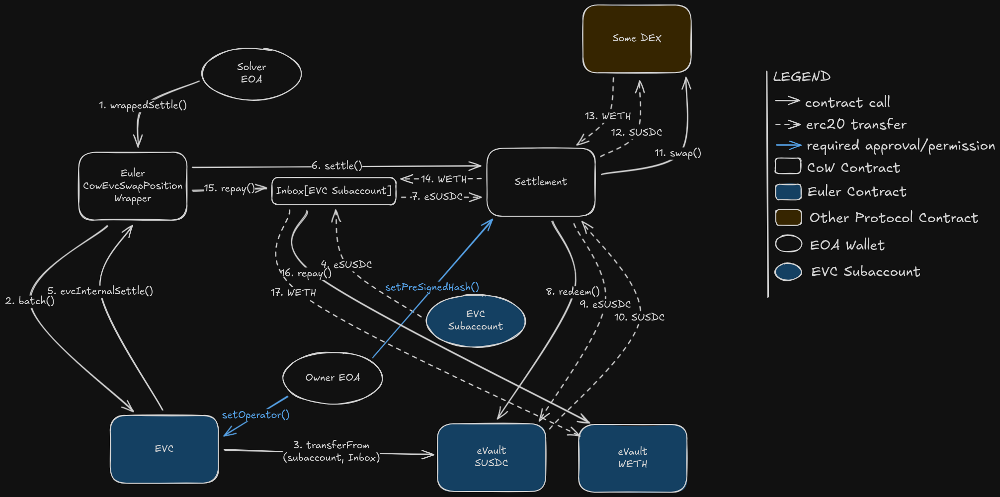

# Closing Leveraged Positions with CowEvcClosePositionWrapper

## Overview

The [`CowEvcClosePositionWrapper`](../../src/CowEvcClosePositionWrapper.sol) enables users to atomically close or reduce leveraged trading positions by:

1. Withdrawing collateral from the vault
2. Swapping collateral back into debt repayment assets via CoW Protocol
3. Repaying the debt
4. Returning excess assets to the user
5. All within a single atomic EVC batch

This wrapper uses an intermediate `Inbox` contract to facilitate settlement while maintaining atomic execution and proper fund custody. Unlike other wrappers, this wrapper uses EIP-1271 signature validation of CoW Orders through the Inbox contract.



## Use Cases

Assuming 1 ETH = 1000 USDC

### Full Position Closure
User wants to completely exit their 5 ETH short (ETH = 1000 USDC):
- Hold 6000 USDC collateral + 5 ETH debt
- Withdraw ~5000-5100 USDC collateral (only the amount required to repay the debt)
- Swap ~5000-5100 USDC to 5 ETH (accounting for interest)
- Repay 5 ETH debt. There shouldbe little/no remaining ETH due to exact out order.
- Keep ~0-1000 USDC remaining collateral in their subaccount

### Partial Position Reduction
User wants to reduce but keep a position:
- Close 3 of 5 ETH debt
- Withdraw ~3000 USDC collateral
- Swap ~3000 USDC to 3 ETH
- Repay 3 ETH debt
- Keep 2 ETH debt, ~3000 USDC collateral remaining

Reducing a position is also a great way to de-risk, since the resulting collateral ratio is higher.

## Transaction Flow

### Step-by-Step Execution

1. **Solver validates authorization**: Checks caller is authenticated solver
2. **Wrapper validates user authorization**: Verifies permit signature or pre-approved hash
3. **Inbox resolution**: Get or create Inbox for the (owner, account) pair
4. **[EVC batch](https://evc.wtf/docs/concepts/internals/batch) assembly**: Wrapper constructs EVC batch items:
   - Optional: EVC.permit() if using permit flow
   - Transfer collateral from subaccount to Inbox (if subaccount different from owner)
   - **Settlement callback**: Call settlement with Inbox as receiver
5. **Settlement execution**: The solver will perform swaps that functionally:
   - Swaps collateral vault tokens into underlying debt asset
   - Sends debt asset to Inbox for repayment
6. **Repayment execution**: Wrapper instructs Inbox to repay debt
7. **Asset return**: Excess funds returned to owner's subaccount
8. **[EVC account health check](https://evc.wtf/docs/concepts/internals/account-status-checks/)**: Verifies remaining position is healthy (if partial closure)
9. **Batch completion**: If all steps succeed, position is closed/reduced

### Fund Flow Diagram

```
User's Subaccount        Settlement         Inbox         Borrow Vault
   (Collateral)          (Swap Logic)    (Temp Holder)     (Debt Record)
        |                     |               |                  |
        |-- withdraw -------->|               |                  |
        |              (collateral)           |                  |
        |                     |--- swap ----->|                  |
        |              (debt asset)           |                  |
        |                     |               |--- repay debt -->|
        |                     |               |                  |
        |<----- return excess ------<--- transfer remainder ----|
        |
```

## Parameters

### ClosePositionParams Structure

```solidity
struct ClosePositionParams {
    address owner;              // User who authorizes and owns the position
    address account;            // EVC subaccount holding the position
    uint256 deadline;           // Operation deadline (block.timestamp must be ≤ this)
    address borrowVault;        // Vault from which debt was borrowed (e.g., eWETH)
    address collateralVault;    // Vault holding collateral (e.g., eUSDC)
    uint256 collateralAmount;   // Amount of collateral to use for repayment
}
```

#### Parameter Details

- **owner**: The user's address that owns the position. CoW order must be signed/authorized by this address.
- **account**: The [EVC subaccount](https://evc.wtf/docs/concepts/internals/sub-accounts) holding the position (usually different from owner if using subaccounts).
- **deadline**: Operation validity deadline and hash uniqueness marker. Increment if executing identical operations.
- **borrowVault**: The vault from which debt was borrowed (e.g., eWETH). The underlying asset (WETH) is what needs repayment.
- **collateralVault**: The vault holding the collateral being swapped (e.g., eUSDC).
- **collateralAmount**: Amount of collateral to withdraw and use for swap. This MUST match the CoW order `sellAmount`.

## CoW Order Construction

### For Full Position Closure (KIND_BUY)

```json
{
  "sellToken": "0x...",           // collateralVault (e.g., eUSDC)
  "buyToken": "0x...",            // underlying debt asset (e.g., WETH)
  "sellAmount": 6000000000000000000,      // == collateralAmount (6000 eUSDC)
  "buyAmount": 5050000000000000000,       // Exact debt + small buffer (5.05 WETH)
  "receiver": "0x...",            // Inbox address for this subaccount
  "kind": "buy",                  // KIND_BUY for full closure (exact output)
  "validTo": 1234567890
}
```

**Explanation**:
- **sellToken**: Must be `collateralVault` (the vault token, e.g., eUSDC)
- **buyToken**: Must be the underlying borrowed asset (e.g., WETH, not eWETH)
- **sellAmount**: Must equal `collateralAmount` parameter. All collateral is sold.
- **buyAmount**: The exact amount of debt that needs repayment, plus small buffer for interest accumulation
- **kind**: "buy" ensures exact output of debt asset - prevents over-selling collateral
- **receiver**: Must be the `Inbox` address returned by `getInbox(owner, account)`

### For Partial Position Closure (KIND_SELL)

```json
{
  "sellToken": "0x...",           // collateralVault (e.g., eUSDC)
  "buyToken": "0x...",            // underlying debt asset (e.g., WETH)
  "sellAmount": 3000000000000000000,      // == collateralAmount (partial, 3000 eUSDC)
  "buyAmount": 2900000000000000000,       // Minimum acceptable (~2.9 WETH)
  "receiver": "0x...",            // Inbox address
  "kind": "sell",                 // KIND_SELL for partial closure
  "validTo": 1234567890
}
```

**Explanation**:
- Same structure as full closure but:
- **sellAmount**: Can be less than total collateral (partial closure)
- **buyAmount**: Is a minimum, not exact (with KIND_SELL)
- **kind**: "sell" allows slippage protection via minimum buy amount

## The Inbox Pattern

### What is an Inbox?

The [`Inbox`](../../src/Inbox.sol) is a contract deployed per EVC subaccount that:

1. **Receives funds from CoW settlement**: Acts as the settlement receiver for repayment assets
2. **Implements [EIP-1271 signature validation](https://eips.ethereum.org/EIPS/eip-1271)**: Allows it to authorize the CoW order
3. **Coordinates fund transfer**: Ensures swapped funds reach the repayment step

### Creating/Retrieving an Inbox

```solidity
// Get or create the Inbox for a subaccount
address inbox = closePositionWrapper.getInboxAddressAndDomainSeparator(owner, account);

// The Inbox address is deterministically computed, so:
// - Same owner+account always returns same Inbox
// - Inbox is auto-created on first use
```

The Inbox can be used as the [EIP-1271 owner/receiver for a CoW order](https://docs.cow.fi/cow-protocol/reference/core/signing-schemes#erc-1271) before it is created due to the determinism.

### Why Inbox is Necessary

CoW Protocol settlement requires an authorized fund source. Since EVC subaccounts are neither EOAs (with private keys) nor regular contracts, we need `Inbox` to:

1. Prove authorization of the order. This is done via EIP-1271 (signed by owner through settlement validation)
2. Accept funds from settlement (as settlement receiver). This allows distinguishing the actual received amount separately from other users who may be using the wrapper at the same time.
3. Transfer funds for repayment while maintaining atomic execution within EVC batch, without needing additional authorization from another account.

## Authorization Flows

Authorization for the close position wrapper is very different from the other wrappers, so be careful to review this section carefully.

### Option 1: [EVC Permit](https://evc.wtf/docs/concepts/internals/permit/) (Off-Chain Signature)

This flow requires **two separate signatures**:

1. **EVC Permit Signature**: Authorizes the wrapper to operate on the owner's behalf
2. **CoW Order Signature**: Authorizes the CoW order itself. Since the `Inbox` contract serves as the source for the CoW order, [EIP-1271](https://docs.cow.fi/cow-protocol/reference/core/signing-schemes#erc-1271). Should be used as the signing scheme, and the CoW order `signature` field is of the format `<address of Inbox><EIP-712 signature of CoW order with Inbox domain separator><abi.encode(orderData)>`

```solidity
// Step 1: Create the EVC permit signature
bytes memory permitData = closePositionWrapper.encodePermitData(params);

// Sign the EVC permit (off-chain) with owner's private key
// This authorizes the wrapper to execute the close operation
// More information: https://evc.wtf/docs/concepts/internals/permit/
bytes memory permitSignature = signEIP712(EVC.domainSeparator(), {
    owner: params.owner,
    spender: address(closePositionWrapper),
    value: uint256(uint160(address(closePositionWrapper))),
    nonce: 0, // Use current nonce
    deadline: params.deadline,
    nonceNamespace: 0,
    data: permitData
});

// Step 2: Create the CoW order signature
// Get the Inbox address and domain separator for this operation
(address inboxAddress, bytes32 inboxDomainSeparator) =
    closePositionWrapper.getInboxAddressAndDomainSeparator(params.owner, params.account);

// Step 3: Encode wrapper data with the permit signature
bytes memory wrapperData = abi.encode(params, permitSignature);

// Create CoW order with Inbox as receiver (refer to parameters documentation)
// Include the wrapper call and the above `wrapperData` in the appData
GPv2Order.Data memory order = /* ... order with receiver = inboxAddress ... */;

// Sign the order using EIP-712 with the Inbox domain separator
// The Inbox will validate this signature during settlement
bytes memory inboxSignature = signEIP712(inboxDomainSeparator, order);

// Send `orderSignature` as the `signature` field to the CoW API
bytes memory orderSignature = abi.encodePacked(inboxAddress, inboxSignature, abi.encode(order));
```

**Note**: The CoW order signature is handled separately during settlement execution. The wrapper data only contains the EVC permit signature.

**Advantages**: Requires no on-chain transactions, one-time authorization per order
**Disadvantages**: Not compatible with smart contract wallets without additional tooling

### Option 2: Pre-Approved Hash (On-Chain, EIP-7702 Compatible)

This flow works by pre-authorizing all operations prior to execution by the solver instead of using permit signatures. The CoW order should be set to [pre-sign](https://docs.cow.fi/cow-protocol/reference/core/signing-schemes#presign).

This means the approvals needed for the permit flow are the same except the off-chain signatures are replaced by:
1. **EVC Operator Authorization for account**: An additional operator approval is needed to grant access to transfer assets out from the specific subaccount.
2. **CoW Order Signature**: Execute an on-chain transaction from the owner's wallet **to the Inbox** to set the `orderUid` corresponding to the the order as authorized.

Here is some pseudocode to generate the on-chain approvals for the settlemen to execute:

```solidity
// Step 1: Set the wrapper as an account operator (allows wrapper to act on behalf of subaccount)
EVC.setAccountOperator(params.account, address(closePositionWrapper), true);

// Step 2: Pre-approve the wrapper operation hash
bytes32 hash = closePositionWrapper.getApprovalHash(params);
closePositionWrapper.setPreApprovedHash(hash, true);

// Step 3: Pre-approve the CoW order on the Inbox (NOT on the settlement contract!)
address inbox = closePositionWrapper.getInbox(params.owner, params.account);
Inbox(inbox).setPreSignature(orderUid, true);

// Later, settlement can be executed with empty signature in wrapper data
// Use the 
bytes memory wrapperData = abi.encode(params, new bytes(0)); // Empty signature
```

**Important**: The CoW order pre-approval must be set on the **Inbox contract**, not on the CoW Settlement contract. Each (owner, account) pair has its own dedicated Inbox.

**Advantages**: With [EIP-7702](https://eips.ethereum.org/EIPS/eip-7702) wallets, can batch all approvals into one transaction. Can be gassless with [EIP-4337](https://eips.ethereum.org/EIPS/eip-4337).
**Disadvantages**: Requires 3-4 on-chain transactions if wallet doesn't support batching

## Important Considerations

## Disabling of Controller and Collaterals

The EVC has a concept of enabling/disbling of [controllers](https://evc.wtf/docs/concepts/internals/controller) and [collaterals](https://evc.wtf/docs/concepts/internals/controller), which allows for detection of the currently open position
for safety checking purposes. In the case of the open position and collaterla swap wrappers, new positions or collaterals will be **automatically enabled** for the user. However, in the case of this wrapper, it is not possible to disable neither the collateral nor the controller for the user. For this reason, we reccomend manually checking the state of the user's controller/collateral on each subaccount before opening a new position.

### Interest Accumulation

Debt accrues interest over time. Therefore:
- **buyAmount (KIND_BUY)**: Should be slightly above current debt to account for interest
- Typically even 0.01% buffer above base debt amount would be sufficient
- If buyAmount is too low, the user may be left with an infitesimely small position in their account

**Example**: If debt is 5 WETH, set buyAmount to ~5.0005 WETH

### Partial Closure and Remaining Position Health

If not closing fully:
- Remaining position must still meet minimum collateral ratio for the transaction to succeed
- Use KIND_SELL order to set minimum buyAmount with slippage protection
- EVC health check validates remaining position

**Example**: Closing 2 ETH of 5 ETH position:
- Must have enough collateral to keep 3 ETH backed above minimum ratio
- If insufficient, closure reverts

### Inbox Address Determinism

Inbox addresses are deterministically computed:
- Same (owner, account) always produces same Inbox
- Different owner/account = different Inbox
- Each wrapper (Close, Open, Collateral Swap) has separate Inbox per subaccount

### Concurrent Operations

Do NOT execute multiple close operations on same subaccount simultaneously. If they execute in the same block, it could lead to excess funds being returned to the user in one operation, and this hasn't been tested. Wait for the previous order to expire before submitting a new one.

### Receiver Configuration

The CoW order's `receiver` parameter MUST be the Inbox address:
- Solvers determine receiver from order data
- If receiver is wrong, funds go to wrong address and operation fails with `NoSwapOutput`
- Use `getInbox(owner, account)` or `getInboxAddressAndDomainSeparator` to get correct address

## Transaction Output

Upon successful closure:

```solidity
event CowEvcPositionClosed(
    address indexed owner,           // Position owner
    address account,                 // Closed subaccount
    address indexed borrowVault,     // Vault debt was from
    address indexed collateralVault, // Vault collateral was from
    uint256 collateralAmount,        // Collateral withdrawn
    uint256 repaidAmount,            // Actual debt repaid (may be > expected due to interest)
    uint256 leftoverAmount           // Excess debt asset returned to owner
);
```

## Error Scenarios

### Off-chain

There are a number of issues that could happen before the order even gets submitted on-chain:

| Error | Cause | Solution |
|-------|-------|----------|
| API rejects the order | Order parameters are incorrect | Review order parameters, especially receiver (Inbox) address |
| CoW does not execute the order, becomes expired | Many possible causes, but most likely `buyAmount` is set too aggressively and solvers are unwilling to solve the order | Review `buyAmount` computation logic; may need larger buffer for interest |

### On-chain

It is recommended to use tracing tools like `cast r <txhash>` to understand why an onchain transaction is failing.

| Error | Cause | Solution |
|-------|-------|----------|
| `NotASolver` | Caller not authenticated solver | Only solvers can call wrappedSettle; execute through CoW API |
| `Unauthorized` | Invalid authorization (bad signature or expired hash) | Review off-chain signing logic |
| `OperationDeadlineExceeded` | Block timestamp > deadline | Increase deadline or resubmit |
| `NoSwapOutput` | Settlement didn't send debt asset to Inbox | Verify Inbox address is correct; check settlement receiver configuration |
| `InsufficientDebt` | Swapped output less than debt | Increase collateralAmount or improve buyAmount estimate |
| `UnexpectedRepayResult` | Debt repayment failed | Add buffer to buyAmount for interest accumulation |
| Account health check reverts | Remaining position undercollateralized | Increase collateralAmount or reduce partial close amount |

## Additional Resources

- [Ethereum Vault Connector Documentation](https://evc.wtf/)
- [EIP-1271 Signature Validation](https://eips.ethereum.org/EIPS/eip-1271)
- [CoW Protocol Documentation](https://docs.cow.fi/)
