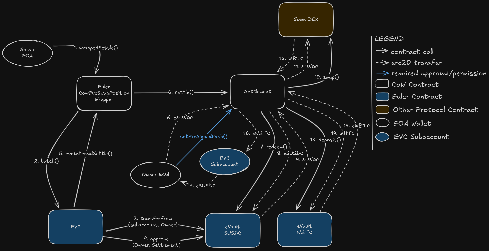

# Swapping Collateral with CowEvcCollateralSwapWrapper

## Overview

The [`CowEvcCollateralSwapWrapper`](../../src/CowEvcCollateralSwapWrapper.sol) enables users to atomically swap collateral between different Euler vaults while maintaining an open leveraged position. This allows position adjustments without closing and reopening.

**Key benefit**: Change collateral composition while keeping debt position intact, with optimal execution through CoW Protocol's distributed solver network.



## Use Cases

Assuming 1 ETH = 1000 USDC

### Collateral Diversification
Position holder wants to reduce concentration:
- Hold 1000 eUSDC collateral + 5 ETH debt
- Swap 500 eUSDC to ~0.5 eWETH (at 1 ETH = 1000 USDC)
- Result: 500 eUSDC + 0.5 eWETH collateral + 5 ETH debt

## Transaction Flow

### Step-by-Step Execution

1. **Solver validates authorization**: Checks caller is authenticated solver
2. **Wrapper validates user authorization**: Verifies permit signature or pre-approved hash
3. **[EVC batch](https://evc.wtf/docs/concepts/internals/batch) assembly**: Wrapper constructs EVC batch items:
   - Optional: EVC.permit() if using permit flow
   - Enable destination vault (toVault) as collateral if not already enabled
   - Transfer collateral from subaccount to owner (if subaccount different from owner)
   - **Settlement callback**: Call settlement to execute CoW swap
4. **Settlement execution**: The solver will perform swaps that functionally:
   - Swaps old collateral vault tokens into new collateral vault tokens
   - Sends new collateral to receiver (subaccount)
5. **Collateral deposit**: New collateral automatically deposited in destination vault
6. **[EVC account health check](https://evc.wtf/docs/concepts/internals/account-status-checks/)**: Verifies account remains properly collateralized
7. **Batch completion**: If all steps succeed, collateral swap is complete

### Fund Flow Diagram

```
Subaccount         Owner EOA       Settlement       Vault Token
   (Old            (Temp Hold)      (Swap Logic)      (New Token)
  Token)              |                  |                  |
    |                 |                  |                  |
    |-- withdraw -->--|                  |                  |
    |              (old token)           |                  |
    |                 |--- sell -------->|                  |
    |           (old token)              |                  |
    |                 |                  |--- buy --------->|
    |                 |             (new token)             |
    |<----- receive new token ---<-------|                  |
    |                                                        |
    |<------------ auto-deposit in toVault -------<---------|
    |
```

## Parameters

### CollateralSwapParams Structure

```solidity
struct CollateralSwapParams {
    address owner;              // User who authorizes the swap
    address account;            // EVC subaccount holding position
    uint256 deadline;           // Operation deadline (block.timestamp must be ≤ this)
    address fromVault;          // Source vault (collateral being swapped out)
    address toVault;            // Destination vault (collateral being swapped in)
    uint256 fromAmount;         // Amount of source vault to withdraw
    uint256 toAmount;           // Amount of destination vault expected
}
```

#### Parameter Details

- **owner**: The user's address that owns the position. CoW order must be signed/authorized by this address.
- **account**: The [EVC subaccount](https://evc.wtf/docs/concepts/internals/sub-accounts) holding the position.
- **deadline**: Operation validity deadline and hash uniqueness marker.
- **fromVault**: The source vault token being withdrawn (e.g., eUSDC).
- **toVault**: The destination vault token being acquired (e.g., eWETH).
- **fromAmount**: Amount of source vault tokens to withdraw. This MUST match the CoW order `sellAmount`.
- **toAmount**: Amount of destination vault tokens expected. This MUST match the CoW order `buyAmount`.

## CoW Order Construction

### Order Parameters

```json
{
  "sellToken": "0x...",           // fromVault (e.g., eUSDC)
  "buyToken": "0x...",            // toVault (e.g., eWETH)
  "sellAmount": 500000000000000000,        // == fromAmount (500 eUSDC)
  "buyAmount": 250000000000000000,         // == toAmount (250 eWETH)
  "receiver": "0x...",            // == account parameter (the subaccount)
  "kind": "sell",                 // Only "sell" is supported
  "validTo": 1234567890
}
```

## Authorization Flows

### Option 1: [EVC Permit](https://evc.wtf/docs/concepts/internals/permit/) (Off-Chain Signature)

This flow requires **two separate signatures** and **one on-chain approval**:

1. **Vault Relayer Approval**: Approves the CoW vault relayer to transfer the source vault tokens
2. **EVC Permit Signature**: Authorizes the wrapper to operate on the owner's behalf
3. **CoW Order Signature**: Authorizes the CoW order itself

```solidity
// Step 1: Approve the vault relayer to spend source vault tokens
// This must be done on-chain before the settlement
IEVault fromVault = IEVault(params.fromVault);
fromVault.approve(cowSettlement.vaultRelayer(), type(uint256).max);

// Step 2: Create the EVC permit signature
bytes memory permitData = collateralSwapWrapper.encodePermitData(params);

// Sign the EVC permit (off-chain) with owner's private key
// This authorizes the wrapper to execute the collateral swap operation
// More information: https://evc.wtf/docs/concepts/internals/permit/
bytes memory permitSignature = signEIP712(EVC.domainSeparator(), {
    owner: params.owner,
    spender: address(collateralSwapWrapper),
    value: uint256(uint160(address(collateralSwapWrapper))),
    nonce: 0, // Use current nonce
    deadline: params.deadline,
    nonceNamespace: 0,
    data: permitData
});

// Step 3: Encode wrapper data with the permit signature
bytes memory wrapperData = abi.encode(params, permitSignature);

// Step 4: Create and authorize the CoW order
// Include the wrapper call and the above `wrapperData` in the appData
GPv2Order.Data memory order = /* ... order with sellAmount = fromAmount ... */;

// Sign the order using EIP-712 with the settlement domain separator
// This can be done via EIP-712 signature or pre-signature on the settlement contract
bytes memory orderSignature = signEIP712(cowSettlement.domainSeparator(), order);
```

**Note**: The CoW order signature is handled separately and can be either an EIP-712 signature or a pre-signature on the settlement contract.

**Advantages**: Minimal on-chain transactions (only one approval needed)
**Disadvantages**: Requires off-chain signature generation, not compatible with smart contract wallets without additional tooling

### Option 2: Pre-Approved Hash (On-Chain, EIP-7702 Compatible)

This means the approvals needed for the permit flow are the same except the off-chain signatures are replaced by:
1. **EVC Operator Authorization for account**: An additional operator approval is needed to grant access to transfer assets out from the specific subaccount.
2. **CoW Order Signature**: Execute an on-chain transaction from the owner's wallet to the CoW Settlement contract to set the `orderUid` corresponding to the the order as authorized.
Here is some pseudocode to generate the on-chain approvals for the settlement to execute:

```solidity
// Step 1: Approve the vault relayer to spend source vault tokens
IEVault fromVault = IEVault(params.fromVault);
fromVault.approve(cowSettlement.vaultRelayer(), type(uint256).max);

// Step 2: Set the wrapper as an account operator for the subaccount
// This allows the wrapper to act on behalf of the subaccount
EVC.setAccountOperator(params.account, address(collateralSwapWrapper), true);

// Step 3: Pre-approve the wrapper operation hash
bytes32 hash = collateralSwapWrapper.getApprovalHash(params);
collateralSwapWrapper.setPreApprovedHash(hash, true);

// Step 4: Pre-approve the CoW order on the settlement contract
cowSettlement.setPreSignature(orderUid, true);

// Later, settlement can be executed with empty signature in wrapper data
bytes memory wrapperData = abi.encode(params, new bytes(0)); // Empty signature
```

**Important**: The wrapper operator must be set for the subaccount to allow the wrapper to perform operations on its behalf.

**Advantages**: With [EIP-7702](https://eips.ethereum.org/EIPS/eip-7702) wallets, can batch all approvals into one transaction. Can be gassless with [EIP-4337](https://eips.ethereum.org/EIPS/eip-4337).
**Disadvantages**: Requires 3-4 on-chain transactions if wallet doesn't support batching

## Important Considerations

### Position Health After Swap

The swap must maintain account health:
- Remaining collateral must still back existing debt
- Different collateral may have different loan-to-value (LTV) ratios
- EVC health check validates this at batch end

**Example**: If swapping from high-LTV eUSDC to lower-LTV eWETH:
- May need to swap MORE of the high-LTV to maintain same backing power
- Or reduce debt before swap if insufficient collateral backing

### Collateral Composition Rules

- Old collateral is withdrawn from source vault before swap
- New collateral is deposited into destination vault after swap
- Both are stored in the same subaccount
- User can hold multiple vault tokens as collateral

### Swap Direction Limitations

- **kind** parameter only supports "sell" (not "buy")
- This means `fromAmount` is exact and `toAmount` is minimum acceptable
- For better slippage control, set `toAmount` appropriately above minimum

### Multiple Swaps in Sequence

You can execute multiple swap operations on the same subaccount:
- Each swap consumes and produces collateral
- Final position must maintain health
- Can chain multiple swaps by using output of one as input to next

**Example sequence**:
1. Swap 500 eUSDC to 250 eWETH
2. Swap 250 eWETH to 100 eDAI
3. Result: 500 eUSDC + 100 eDAI collateral (original 500 eUSDC went to other swaps)

## Special Handling for Subaccounts

If using a subaccount (account ≠ owner):

1. Collateral is initially in subaccount
2. Wrapper transfers old collateral from subaccount to owner
3. CoW settlement swaps in owner's custody
4. New collateral is returned to subaccount
5. New collateral auto-deposits into destination vault

This ensures:
- Old and new collateral remain within user's control (subaccount)
- Atomic execution within EVC batch
- Proper fund custody throughout operation

## Transaction Output

Upon successful swap:

```solidity
event CowEvcCollateralSwapped(
    address indexed owner,           // Position owner
    address account,                 // Subaccount where swap occurred
    address indexed fromVault,       // Source vault
    address indexed toVault,         // Destination vault
    uint256 fromAmount,              // Amount swapped out
    uint256 toAmount                 // Amount swapped in
);
```

## Error Scenarios

### Off-chain

There are a number of issues that could happen before the order even gets submitted on-chain:

| Error | Cause | Solution |
|-------|-------|----------|
| API rejects the order | Order parameters are incorrect | Review order parameters and vault addresses |
| CoW does not execute the order, becomes expired | Many possible causes, but most likely `toAmount` (buyAmount) is set too aggressively and solvers are unwilling to solve the order | Review `toAmount` computation logic; may need more conservative slippage allowance |

### On-chain

It is recommended to use tracing tools like `cast r <txhash>` to understand why an onchain transaction is failing.

| Error | Cause | Solution |
|-------|-------|----------|
| `NotASolver` | Caller not authenticated solver | Only solvers can call wrappedSettle; execute through CoW API |
| `Unauthorized` | Invalid authorization (bad signature or expired hash) | Review off-chain signing logic |
| `OperationDeadlineExceeded` | Block timestamp > deadline | Increase deadline or resubmit |
| `SubaccountMustBeControlledByOwner` | Account doesn't share bits with owner | Use valid EVC subaccount sharing owner's high 19 bits |
| Settlement reverts | Insufficient swap output | Increase fromAmount or improve toAmount estimate |
| Account health check reverts | Position would be undercollateralized after swap | Reduce fromAmount or verify collateral-to-debt ratio |
| Vault enable fails | Destination vault not supported or not authorized | Verify toVault is valid Euler vault and is authorized as collateral for debt |

## Additional Resources

- [Ethereum Vault Connector Documentation](https://evc.wtf/)
- [CoW Protocol Documentation](https://docs.cow.fi/)
- [Euler Vault Documentation](https://docs.euler.finance/)
